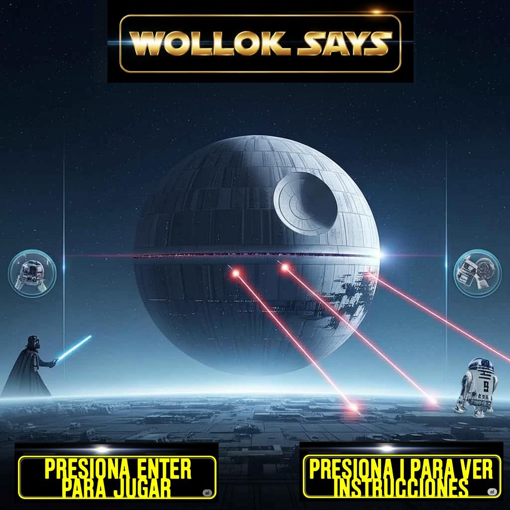
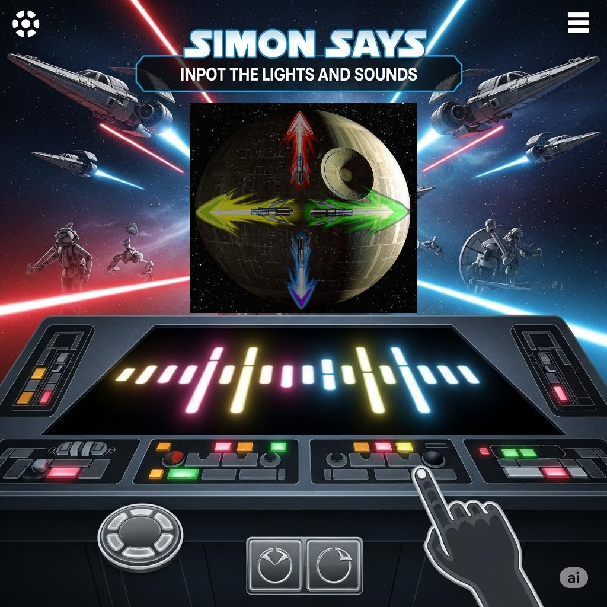
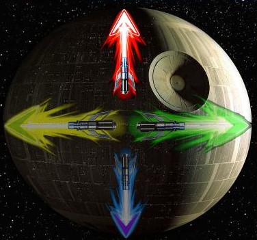
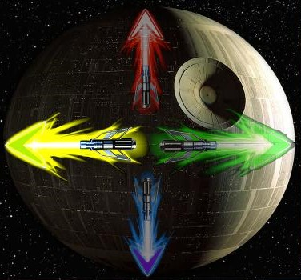
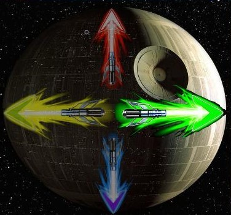
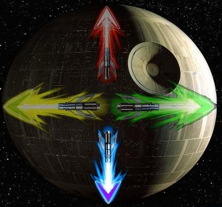

# Wollok Dice

## Equipo de desarrollo

-   Malena Celeste Fernandez Mansilla
-   Lucas F. Silva
-   Rafael Barberi Salcedo
-   Guido Betran
-   Carla Andrea Perez
-   Alan domingues

## Capturas

## Reglas de Juego / Instrucciones

Wollok Dice es una versión individual del clásico juego “Simón dice”, diseñada para entrenar la memoria y la atención.

Objetivo
El jugador debe repetir los colores en el orden que aparecen utilizando las flechas direccionales (↑ ↓ → ←).

Cómo se juega:

-   El sistema muestra una secuencia de colores.
-   El jugador debe ingresar o reproducir la secuencia.
-   Si el jugador repite un color que no fue mostrado en el orden de la secuencia por “Wollok dice”, el juego termina.

A medida que el jugador avanza, la secuencia se vuelve más larga y difícil.

## Otros

-   Objetos 1 - Comision 1/ UNAHUR
-   Versión de wollok 4.0
