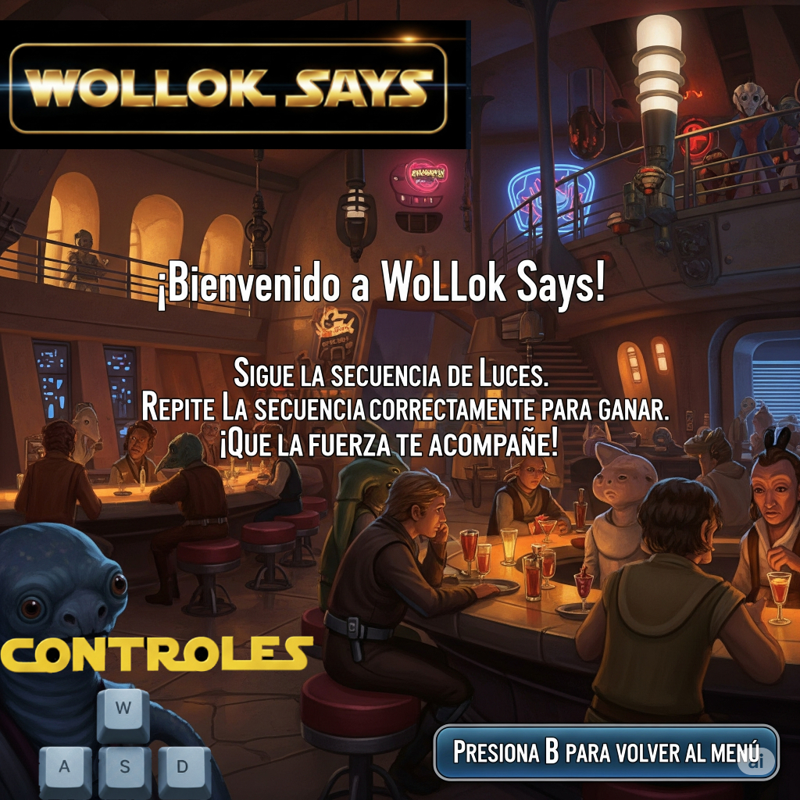

# Wollok Dice 

## Reglas de Juego / Instrucciones

Wollok Dice es una versión individual del clásico juego “Simón dice”, diseñada para entrenar la memoria y la atención.
Cuenta con dos niveles, para seleccionar el nivel se utiliza el numero 1 o el numero 2.
  - (1) Nivel Padawan.
  - (2) Nivel Jedi. Comienza con 4 colores ya establecidos. 

Objetivo
El jugador debe repetir los colores en el orden que aparecen utilizando las letras (a (amarillo) s (azul) d (verde) w (rojo)).

Cómo se juega:
-   El sistema muestra una secuencia de colores.
-   El jugador debe ingresar o reproducir la secuencia.
-   Si el jugador repite un color que no fue mostrado en el orden de la secuencia por “Wollok dice”, el juego termina.

A medida que el jugador avanza, la secuencia se vuelve más larga y difícil.

## HighScore
-  En cada instancia de juego, hay un top 3 con los mejores puntajes, la idea es q se pueda competir sanamente entre amigos. 
-  El funcionamiento del mismo es, si no hay puntajes, se guarda el puntaje, una vez que haya tres puntajes, solo se guardara si supera alguno de los puntajes maximos.
-  Para poder elegir el nombre para el puntaje se utilizan las flechas:
      - Para elegir la letra (↑ ↓) 
      - Para la posicion de la letra (→ ←).

## Equipo de desarrollo - Estudiantes de la carrera Tec en Programacion (UNAHUR)

-   Malena Celeste Fernandez Mansilla
-   Lucas F. Silva
-   Rafael Barberi Salcedo
-   Guido Betran
-   Carla Andrea Perez
-   Alan domingues

## Capturas

## Reconocimientos:
- Queriamos nombrar a nuestro docente a cargo, Hernan Coniglio, por darnos las herramientas y los desafios en este trabajo integrador. Como equipo tuvimos la idea de las puntuaciones maximas pero el nos insistio en que lo intentemos y quedamos muy conformes con lo logrado. 

## Otros
-   Objetos 1 - Comision 1 Primer cuatrimestre 2025 / UNAHUR
-   Versión de wollok 4.0

